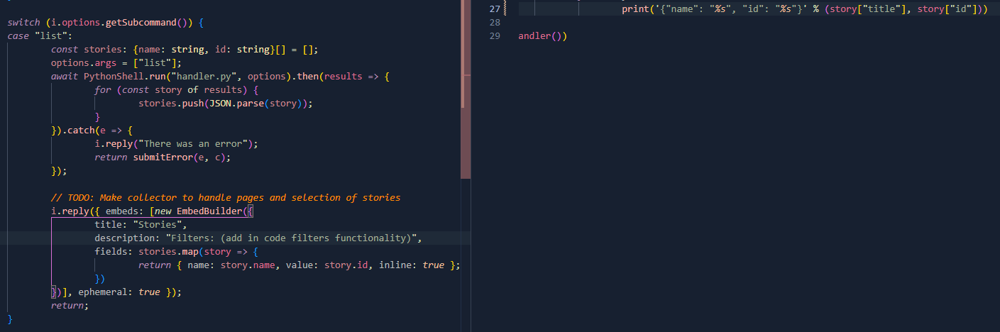
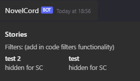

# I HAVE NO AFFILIATION TO NOVELAI. ANY AND ALL PROBLEMS REGARDING NOVELAI OR THE PYTHON API MUST GO TO THE RESPECTIVE PEOPLE

# NovelCord
NovelCord is a Discord Bot meant to integrate NovelAi stories directly into your server.

## Requirements
- [Python v3.11.2](https://www.python.org/downloads/)  
	- [NovelAI_API](https://github.com/Aedial/novelai-api/tree/main)
		- **Found an interesting thing to keep note of. As of right now, 8-16-2023, you can not use Editor v2 on NovelAi. It changes the formatting of the data. You can update stories to the new editor if you want, just note that stories by this bot will not function. To prevent this, change in your settings->interface-> Use Editor V2 for New Stories: off**
- [NodeJS v18.14.1](https://nodejs.org/en)
	- Install packages using your preferred manager.

**Disclaimer**:  
The Database is a JSON DB. I will try to make it as minimal as possible, so if you want, you can use something such as MySQL, Mongo, and others.

## Current Plans Moved To [Trello](https://trello.com/b/0Vcb2g1q)
#### Yell at me, I hate that I'm doing it in python like this, but it works. I dont know of any Javascript libraries for NovelAi. I'm still kind of tempted to create one myself, however, I have no knowledge of really how to use github.

I will be changing the way `story.id` is returned, as there are multiple IDs  

## Setup ( NOT BEING UPDATED AT THIS TIME )
Using your [NovelAi](https://novelai.net) account, insert your username and password inside the **[.env](python/example.env)**  
Head to the [DDP](https://discord.com/developers/applications) to get your bot Token, then paste it into the **[.env](src/secrets/example.env)**

**! ⚠️ ================================================ ⚠️ !  
  I know I can combine the [Python .env](python/example.env) and [Js .env](src/secrets/example.env), but I am not very keen to figure out the implications of going outside the root directory to handle this.  
  If you know how to do this, feel free to do that.  
! ⚠️ ================================================ ⚠️ !**  

*using pnpm*  
Scripts are as follows:  
---
`pnpm build`  
Copy the [Js .env](src/secrets/example.env) to `build/secrets/` as `.env`  

**(*To create commands, use `:create` However, you can also use `:delete`*)**  
**(*`:guild` currently only updates to one server at a time*)**    
`pnpm deploy:guild:create` **or** `pnpm deploy:global:create`  
`pnpm start`

Assuming everything is installed correctly, inserted correctly it should run.

**If the `.env` is setup inside of build, you can run `pnpm test` to quick start it with one command. However, as the script implies, it's mainly used to test the bot, as it Builds and deploys commands as well.**

**! ⚠️ ================================================ ⚠️ !  
  One thing to keep in mind, it may take a while to get a response.  
  I will be taking my time to learn more of this API and trying to optimize what I can.  
! ⚠️ ================================================ ⚠️ !**